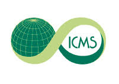
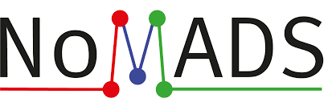

<html>
<head>

</head>
  
<body>
  

<b>***Due to the ongoing covid-19 pandemic we have taken the decision to postpone the workshop by 1 year. The workshop will now be held in two parts. The first part is online only and will take place 26th-30th July 2021. The second part is in-person and will be held in January 2022 at the University of Bath.***</b>

<h1>Overview and Aims</h1>

As we enter the age of data we have seen the birth of machine learning methods to a diverse range of applications, including computer vision, classification/clustering, regression, data mining and prediction. Machine learning has been remarkably successful in applications but our theoretical understanding of many machine learning algorithms is still missing. This has led to an increasing appetite for the mathematical analysis of machine learning algorithms. Particularly exciting is the potential for methods from applied mathematics, probability theory, and statistics to contribute to machine learning theory.

The aim of the workshop is to bring together researchers that apply mathematical methodology to machine learning.
We particularly want to emphasise how mathematical theory can inform applications and vice versa.

This workshop is the first of two workshops on this topic. The second will be an in-person workshop to be held at the University of Bath, in December 2021. In this first workshop, invited speakers are encouraged to present open problems and explore interesting directions for potential research as part of their talk. The schedule allows participants time to initiate conversations and collaborations that can be developed at the winter workshop.

  
 
The two workshops in this series follow on from the <a href="https://mathml2020.github.io/index">LMS-Bath Symposium on the Mathematics of Machine Learning</a> held 3-7 August 2020.

  
<h1>Confirmed Speakers</h1>

<!---
The following speakers are confirmed:
--->
<!---<a href="https://bathicmsworkshop.github.io/....pdf">[slides]</a>---> 
<ul>
  <li>Andres Almansa (Université de Paris) <a href="https://bathicmsworkshop.github.io/AndresAlmansa.pdf">[slides]</a> <a href="https://bathicmsworkshop.github.io/AndresAlmansaVideo.mp4">[inpainting video]</a></li> 
  <li>Coloma Ballester (Universitat Pompeu Fabra) <a href="https://bathicmsworkshop.github.io/ColomaBallesterLowRes.pdf">[slides]</a></li>
  <li>Andrea Bertozzi (University of California, Los Angeles)</li>
  <li>Christoph Brune (University of Twente) <a href="https://bathicmsworkshop.github.io/ChristophBrune.pdf">[slides]</a></li>
  <li>Jeff Calder (University of Minnesota) <a href="https://bathicmsworkshop.github.io/JeffCalder.pdf">[slides]</a></li>
  <li>Daniel Cremers (Technische Universität München)</li>
  <!---<li>Julie Delon (Paris Descartes University)</li>--->
  <li>Matthias Ehrhardt (University of Bath)</li>
  <li>Abderrahim Elmoataz (University of Caen Basse Normandy)</li>
  <!---<li>Cristina Garcia-Cardona (Los Alamos National Lab)</li>--->
  <li>Franca Hoffmann (Rheinische Friedrich-Wilhelms-Universität Bonn) <a href="https://bathicmsworkshop.github.io/FrancaHoffmann.pdf">[slides]</a></li>
  <li>Yury Korolev (University of Cambridge)</li>
  <li>Jonas Latz (University of Cambridge)</li>
  <li>Youssef Marzouk (Massachusetts Institute of Technology) <a href="https://bathicmsworkshop.github.io/YoussefMarzouk.pdf">[slides]</a></li>
  <li>Pablo Muse (Universidad de la República de Uruguay) <a href="https://bathicmsworkshop.github.io/PabloMuse.pdf">[slides]</a></li>
  <li>Omiros Papaspiliopoulos (Universitat Pompeu Fabra)</li>
  <li>Mathew Penrose (University of Bath) <a href="https://bathicmsworkshop.github.io/MathewPenrose.pdf">[slides]</a></li>
  <li>Philipp Petersen (University of Vienna)</li>
  <li>Johannes Schmidt-Hieber (University of Twente) <a href="https://bathicmsworkshop.github.io/JohannesSchmidtHieber.pdf">[slides]</a></li>
  <li>Bernhard Schmitzer (University of Göttingen) <a href="https://bathicmsworkshop.github.io/BernhardSchmitzer.pdf">[slides]</a></li>
  <li>Yves van Gennip (Delft University of Technology)</li>
  <li>Kostas Zygalakis (University of Edinburgh) <a href="https://bathicmsworkshop.github.io/KostasZygalakis.pdf">[slides]</a></li>
</ul>

<h1>Organisers</h1>

<!---
Oganisers here.
--->
<ul>
  <li><a href="https://bamdadhosseini.org/">Bamdad Hosseini</a>, California Institute of Technology</li>
  <li><a href="https://www.research.manchester.ac.uk/portal/matthew.thorpe-2.html">Matthew Thorpe</a>, University of Manchester</li>
  <li><a href="https://www.upf.edu/web/patricia-vitoria">Patricia Vitoria Carrera</a>, Universitat Pompeu Fabra</li>
</ul>
  

<h1>Summer Registration</h1>

  
Please complete the registration form <a href="https://forms.office.com/Pages/ResponsePage.aspx?id=Ij1-N6FOLUKwrY_MiUBrnndyxq79pTBHhzzs2fobY9tUQktITE82UjdJWDlCMEYyQ0hJOFE2WkszTyQlQCN0PWcu">here</a> to join the summer workshop.

<h1>Summer Schedule</h1>

<!---
The schedule for the summer workshop can be downloaded <a href="https://bathicmsworkshop.github.io/WorkshopSchedule7.pdf">here.</a>
--->

 The schedule for the summer workshop is below.

  
<!---<embed src="https://bathicmsworkshop.github.io/WorkshopSchedule7.pdf" width="600px" height="500px" />--->
<!---<embed src="https://bathicmsworkshop.github.io/WorkshopSchedule7.pdf" type="application/pdf" />--->
<embed src="https://bathicmsworkshop.github.io/WorkshopSchedule8.pdf" width="100%" height="850px"/>
  

 Titles and abstracts are below.

 
<embed src="https://bathicmsworkshop.github.io/TitlesAndAbstracts.pdf" width="100%" height="850px"/>

 The slides from the workshop opening are below.

 
<embed src="https://bathicmsworkshop.github.io/ICMS__LMS_Workshop_on_Analytic_and_Geometric_Approaches_to_Machine_Learning.pdf" width="100%" height="850px"/>
  
  
<!---<h1>Contact</h1>

Contact here.
--->
  
 <!--- Other website: https://www.icms.org.uk/events/workshops/AGAML, https://imibath.ac.uk/news/lms-icms-symposium-analytic-and-geometric-approaches-to-machine-leaning/--->

<h1>Sponsors</h1>

The workshop is funded by the <a href="https://www.icms.org.uk/">International Centre for Mathematical Sciences (ICMS)</a> and supported by <a href="https://www.uni-muenster.de/NoMADS/">NoMADS</a> (which in turn received funding from the European Union's Horizon 2020 research and innovation programme under grant agreement No. 777826). We are grateful for the hospitality of the University of Bath.

  

    
  

  

    
  

  

    
  

</body>
</html>
