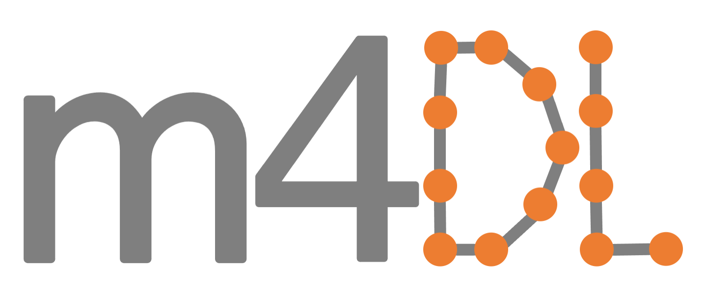

<html>
<head>

</head>
  
<body>
  
<!---
<b>***Due to the ongoing covid-19 pandemic we have taken the decision to postpone the workshop by 1 year. The workshop will now be held in two parts. The first part is online only and will take place 26th-30th July 2021. The second part is in-person and will be held in January 2022 at the University of Bath.***</b>
--->

<h1>Overview and Aims</h1>

As we enter the age of data we have seen the birth of machine learning methods to a diverse range of applications, including computer vision, classification/clustering, regression, data mining and prediction. Machine learning has been remarkably successful in applications but our theoretical understanding of many machine learning algorithms is still missing. This has led to an increasing appetite for the mathematical analysis of machine learning algorithms. Particularly exciting is the potential for methods from applied mathematics, probability theory, and statistics to contribute to machine learning theory.

The aim of these workshops is to bring together researchers that apply mathematical methodology to machine learning.
We particularly want to emphasise how mathematical theory can inform applications and vice versa.

The first workshop was held online on the 26th-30th July 2021. The second workshop will be held on the 11th-15th July 2022 at the University of Bath. In the first workshop invited speakers were encouraged to present open problems and explore interesting directions for potential research as part of their talk. These topics and areas of research will initiate conversations and collaborations to be developed at the forthcoming 2022 workshop.

  

We are grateful to our sponsors: the ICMS, <a href="https://www.uni-muenster.de/NoMADS/">NoMADS</a>, <a href="https://people.bath.ac.uk/mascjb/maths4dl.html">Maths4DL</a> and the university of Bath.

  

The two workshops in this series follow on from the <a href="https://mathml2020.github.io/index">LMS-Bath Symposium on the Mathematics of Machine Learning</a> held 3-7 August 2020.

<h1>Confirmed Participants in the 2022 Workshop</h1>

<ul>
  <li>Andres Almansa (Université de Paris)</li>
  <li>Gianluca Audone (University of Bath)</li>
  <li>Coloma Ballester (Universitat Pompeu Fabra)</li>
  <!---<li>Andrea Bertozzi (University of California, Los Angeles)</li>--->
  <li>Juliane Braunsmann (University of Muenster)</li>
  <li>Christoph Brune (University of Twente)</li>
  <li>Jeremy Budd (University of Bonn)</li>
  <!---<li>Jeff Calder (University of Minnesota)</li>--->
  <li>Cangxiong Chen (University of Bath)</li>
  <!---<li>Daniel Cremers (Technische Universität München)</li>--->
  <!---<li>Julie Delon (Paris Descartes University)</li>--->
  <li>Sergey Dolgov (University of Bath)</li>
  <li>Margaret Duff (University of Bath)</li>
  <li>Emiko Dupont (University of Bath)</li>
  <li>Nicolas Durrande (Secondmind AI)</li>
  <li>Ritabrata Dutta (Warwick)</li>
  <li>Matthias Ehrhardt (University of Bath) <a href="https://drive.google.com/file/d/12mTF9MOmyJvkYDdXblVZKbbO70p6j1UC/view?usp=sharing">[slides]</a></li>
  <!---<li>Abderrahim Elmoataz (University of Caen Basse Normandy)</li>--->
  <!---<li>Cristina Garcia-Cardona (Los Alamos National Lab)</li>--->
  <li>Matteo Garbelli (Trento) <a href="https://drive.google.com/file/d/12uv1Dtg8YScRjmY1FH3BltN07Hp2WiNx/view?usp=sharing">[slides]</a></li>
  <li>Bertrand Gauthier (University of Cardiff) <a href="https://drive.google.com/file/d/12mqUcjomrYW_zjuVgq_Q6xBgSbnenW7G/view?usp=sharing">[slides]</a></li>
  <li>Carina Geldhauser (Lund)</li>
  <li>Tamara Großmann (University of Cambridge)</li>
  <!---<li>Franca Hoffmann (Rheinische Friedrich-Wilhelms-Universität Bonn)</li>--->
  <li>Samuel Hurault (Universite de Bordeaux)</li>
  <!---<li>Anna Korba (ENSAE/CREST)</li>--->
  <li>Yury Korolev (University of Cambridge)</li>
  <li>Lorenz Kuger (Friedrich-Alexander-University of Erlangen-Nuernberg) </li>
  <li>Jonas Latz (Heriot Watt)</li>
  <!---<li>Youssef Marzouk (Massachusetts Institute of Technology)</li>--->
  <li>Pablo Muse (Universidad de la República de Uruguay)</li>
  <li>Lukman Olawale (University of Greenwich)</li>
  <!---<li>Omiros Papaspiliopoulos (Universitat Pompeu Fabra)</li>--->
  <li>Mathew Penrose (University of Bath)</li>
  <!---<li>Philipp Petersen (University of Vienna)</li>--->
  <!---<li>Marcelo Pereyra (University of Edinburgh)</li>--->
  <!---<li>Johannes Schmidt-Hieber (University of Twente)</li>--->
  <li>Mohammad Sadegh Salehi (University of Bath)</li>
  <li>Malena Sabete Landman (University of Cambridge)</li>
  <li>Bernhard Schmitzer (University of Göttingen) <a href="https://drive.google.com/file/d/12q1XcY9qERavv6HSilCUZKdPhsBZ48N8/view?usp=sharing">[slides]</a></li>
  <li>Timothée Stumpf-Fetizon (University of Warwick) <a href="https://drive.google.com/file/d/12x-im5e04NgM2R-u9LyyTiGqoR0czdHH/view?usp=sharing">[slides]</a></li>
  <li>Laura Thesing (Ludwig-Maximilians Universitat Munchen)</li>
  <li>Yves van Gennip (Delft University of Technology)</li>
  <!---<li>Melanie Weber (University of Oxford)</li>--->
  <li>Adrien Weihs (University of Manchester)</li>
  <li>Stephan Wojtowytsch (Texas Austin) <a href="https://drive.google.com/file/d/12nHTGMrbvnSummMa0dl8xjphCfCuvGbF/view?usp=sharing">[slides]</a></li>
  <li>Hong Ye Tan (University of Cambridge)</li>
  <!---<li>Kostas Zygalakis (University of Edinburgh)</li>--->
</ul>

  
<h1>Confirmed Speakers in the 2021 Workshop</h1>

<!---
The following speakers are confirmed:
--->
<!---<a href="https://bathicmsworkshop.github.io/....pdf">[slides]</a>---> 
<ul>
  <li>Andres Almansa (Université de Paris) <a href="https://bathicmsworkshop.github.io/AndresAlmansa.pdf">[slides]</a> <a href="https://bathicmsworkshop.github.io/AndresAlmansaVideo.mp4">[inpainting video]</a></li> 
  <li>Coloma Ballester (Universitat Pompeu Fabra) <a href="https://bathicmsworkshop.github.io/ColomaBallesterLowRes.pdf">[slides]</a></li>
  <li>Andrea Bertozzi (University of California, Los Angeles)</li>
  <li>Christoph Brune (University of Twente) <a href="https://bathicmsworkshop.github.io/ChristophBrune.pdf">[slides]</a></li>
  <li>Jeff Calder (University of Minnesota) <a href="https://bathicmsworkshop.github.io/JeffCalder.pdf">[slides]</a></li>
  <li>Daniel Cremers (Technische Universität München)</li>
  <!---<li>Julie Delon (Paris Descartes University)</li>--->
  <li>Matthias Ehrhardt (University of Bath)  <a href="https://bathicmsworkshop.github.io/MatthiasEhrhardt.pdf">[slides]</a> </li>
  <li>Abderrahim Elmoataz (University of Caen Basse Normandy)</li>
  <!---<li>Cristina Garcia-Cardona (Los Alamos National Lab)</li>--->
  <li>Franca Hoffmann (Rheinische Friedrich-Wilhelms-Universität Bonn) <a href="https://bathicmsworkshop.github.io/FrancaHoffmann.pdf">[slides]</a></li>
  <li>Yury Korolev (University of Cambridge)</li>
  <li>Jonas Latz (University of Cambridge)</li>
  <li>Youssef Marzouk (Massachusetts Institute of Technology) <a href="https://bathicmsworkshop.github.io/YoussefMarzouk.pdf">[slides]</a></li>
  <li>Pablo Muse (Universidad de la República de Uruguay) <a href="https://bathicmsworkshop.github.io/PabloMuseHandout.pdf">[slides]</a></li>
  <li>Omiros Papaspiliopoulos (Universitat Pompeu Fabra)</li>
  <li>Mathew Penrose (University of Bath) <a href="https://bathicmsworkshop.github.io/MathewPenrose.pdf">[slides]</a></li>
  <li>Philipp Petersen (University of Vienna)</li>
  <li>Johannes Schmidt-Hieber (University of Twente) <a href="https://bathicmsworkshop.github.io/JohannesSchmidtHieber.pdf">[slides]</a></li>
  <li>Bernhard Schmitzer (University of Göttingen) <a href="https://bathicmsworkshop.github.io/BernhardSchmitzer.pdf">[slides]</a></li>
  <li>Yves van Gennip (Delft University of Technology)</li>
  <li>Kostas Zygalakis (University of Edinburgh) <a href="https://bathicmsworkshop.github.io/KostasZygalakis.pdf">[slides]</a></li>
</ul>

<h1>Organisers</h1>

<!---
Oganisers here.
--->
<ul>
  <li><a href="https://bamdadhosseini.org/">Bamdad Hosseini</a>, University of Washington</li>
  <li><a href="https://people.bath.ac.uk/lmk54/">Lisa Kreusser</a>, University of Bath</li>
  <li><a href="https://www.matthewthorpe.co.uk/home">Matthew Thorpe</a>, University of Manchester</li>
  <li><a href="https://www.upf.edu/web/patricia-vitoria">Patricia Vitoria Carrera</a>, Huawei Zurich</li>
</ul>
  

<h1>2022 Workshop Registration</h1>

<!---  
Please complete the registration form <a href="https://forms.office.com/Pages/ResponsePage.aspx?id=Ij1-N6FOLUKwrY_MiUBrnndyxq79pTBHhzzs2fobY9tUQktITE82UjdJWDlCMEYyQ0hJOFE2WkszTyQlQCN0PWcu">here</a> to join the summer workshop.
--->
<!---  
 Information about how to register for the 2022 workshop will appear here shortly. 
--->
  
Please complete the registration form <a href="https://eur01.safelinks.protection.outlook.com/?url=https%3A%2F%2Fforms.office.com%2FPages%2FResponsePage.aspx%3Fid%3DIj1-N6FOLUKwrY_MiUBrnndyxq79pTBHhzzs2fobY9tUNVlFS0dOVlFCWko1UEFIV0FZSTRKMlM4QiQlQCN0PWcu%26wdLOR%3Dc176E9159-0BF9-4BB6-AD08-3D5FE5E57F5E&data=05%7C01%7Clmk54%40bath.ac.uk%7C966357bfdefa4cf2711b08da29cd8128%7C377e3d224ea1422db0ad8fcc89406b9e%7C0%7C0%7C637868259855134170%7CUnknown%7CTWFpbGZsb3d8eyJWIjoiMC4wLjAwMDAiLCJQIjoiV2luMzIiLCJBTiI6Ik1haWwiLCJXVCI6Mn0%3D%7C3000%7C%7C%7C&sdata=pK9VSKPnKiEFom8Ld2f4vh5yKtK6VudleWobOUKkDoI%3D&reserved=0">here</a> to apply to join the summer 2022 workshop. The deadline for completing the form is 26th June 2022, and to apply for funding you should apply before the 15th May 2022.

<h1>2022 Workshop Schedule</h1>

<!---
The schedule for the summer workshop can be downloaded <a href="https://bathicmsworkshop.github.io/WorkshopSchedule7.pdf">here.</a>
--->
<!---
 The schedule for the summer workshop is below.
--->
  
<!---<embed src="https://bathicmsworkshop.github.io/WorkshopSchedule7.pdf" width="600px" height="500px" />--->
<!---<embed src="https://bathicmsworkshop.github.io/WorkshopSchedule7.pdf" type="application/pdf" />--->
<!---<embed src="https://bathicmsworkshop.github.io/WorkshopSchedule8.pdf" width="100%" height="850px"/>--->
  
  
 The 2022 workshop schedule and joning information can be found <a href="https://drive.google.com/file/d/12l5ip-9MY_yS_mEzcM5X29J6pZoQCcu3/view?usp=sharing">here</a>. 

<h1>2021 Workshop Titles and Abstracts</h1>
  

 Titles and abstracts for the 2021 workshop are below.

 
<embed src="https://bathicmsworkshop.github.io/TitlesAndAbstracts.pdf" width="100%" height="850px"/>

 The slides from the 2021 workshop opening are below.

 
<embed src="https://bathicmsworkshop.github.io/ICMS__LMS_Workshop_on_Analytic_and_Geometric_Approaches_to_Machine_Learning.pdf" width="100%" height="850px"/>
  
  
<!---<h1>Contact</h1>

Contact here.
--->
  
 <!--- Other website: https://www.icms.org.uk/events/workshops/AGAML, https://imibath.ac.uk/news/lms-icms-symposium-analytic-and-geometric-approaches-to-machine-leaning/--->

<h1>Sponsors</h1>

The workshop is funded by the <a href="https://www.icms.org.uk/">International Centre for Mathematical Sciences (ICMS)</a> and supported by <a href="https://www.uni-muenster.de/NoMADS/">NoMADS</a> (which in turn received funding from the European Union's Horizon 2020 research and innovation programme under grant agreement No. 777826). We are grateful for the hospitality of the University of Bath.

  

    
  

  

    
  

  

    
  

  

    
  

</body>
</html>
